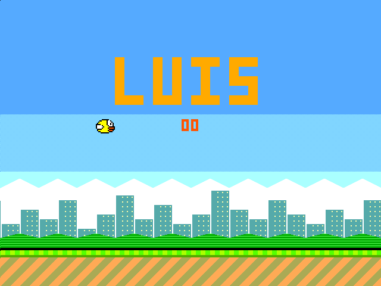
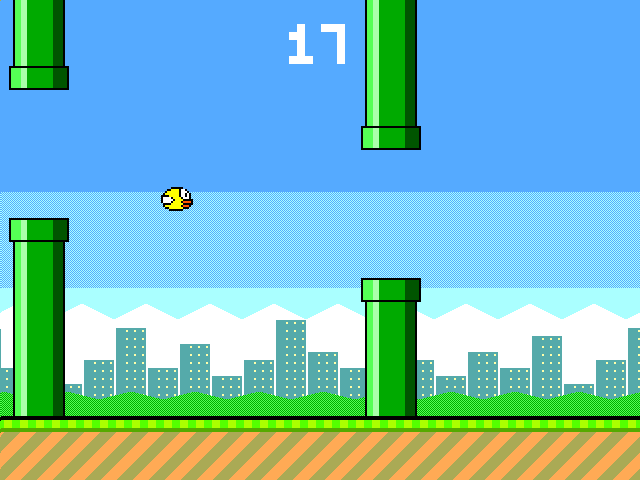

## How it works

**Flappy Luis** is a complete Flappy-style video game implemented in hardware. There is no CPU and no
software: every pixel is computed on the fly by logic gates while the VGA beam scans the screen
(640x480 at 60 Hz, 25.175 MHz pixel clock).

The game is built from a few hardware blocks:

- **VGA timing** (`hvsync_generator`): horizontal and vertical counters that produce `hsync`, `vsync`
  and the current pixel position.
- **Game logic**, updated once per frame during vertical blanking:
  - the bird has a 9.2 fixed-point height and a signed velocity, with gravity and a flap impulse;
  - two pipes scroll left and respawn on the right with a random gap from a 16-bit LFSR;
  - the score and the best score are kept as BCD digits (0-99);
  - collisions are detected pixel-perfect while drawing: if a bird pixel is drawn on top of a
    pipe pixel during a frame, the bird crashes;
  - a game state machine: title screen, playing, and game over (with a white flash).
- **Renderer**, evaluated for every pixel, from back to front: sky gradient with dithering, clouds,
  a city skyline with lit windows and bushes (scrolling slower than the pipes, for a parallax
  effect), the pipes with caps and shading, the ground with scrolling stripes, the 16x12 bird
  sprite (with an animated wing), and the text ("LUIS" title, score and best score) using a
  3x5 pixel font.
- **Sound**: 1-bit square waves and noise for flapping, scoring and crashing, on `uio[7]`. The
  scanline counter doubles as the tone generator, so the sound costs almost no extra logic.
- **Autopilot**: when `ui[1]` is high, the chip plays by itself, flapping when the bird falls
  near the bottom of the next gap. Great for demos.

To fit in a single tile, the two pipes share one position register (they are always 352 px
apart) and one renderer: at most one pipe can be under the beam at any time.

## How to test

Connect a TinyVGA Pmod to the outputs and a VGA monitor, and set the clock to 25.175 MHz
(25.2 MHz also works).

- Title screen: the big "LUIS" title and the best score.
- Flap: flip the `ui[0]` switch (every change of `ui[0]` is one flap), or press a push button
  connected to `ui[2]` (one flap per press).
- Fly through the gaps between the pipes. Each pipe you pass is one point.
- When you crash, the screen flashes and the bird falls. Press again to go back to the title.
- `ui[1]` = 1: autopilot (demo mode), the game plays by itself forever.

You can also play it in the browser with the Tiny Tapeout VGA Playground: open
`https://vga-playground.com/?repo=<this repository URL>` and press `0` on the keyboard to flap
(`1` turns the autopilot on and off).

## External hardware

- [TinyVGA Pmod](https://github.com/mole99/tiny-vga) on the output pins, and a VGA monitor.
- Optional: a push button on `ui[2]`.
- Optional: an audio Pmod or a small speaker/amplifier on `uio[7]` for sound.
